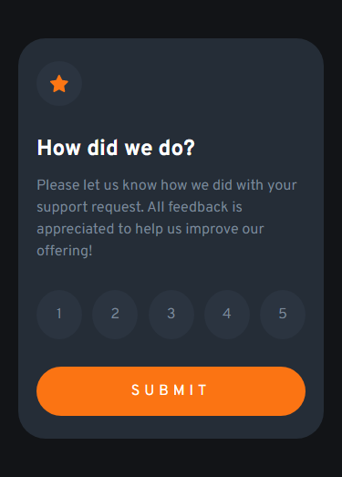
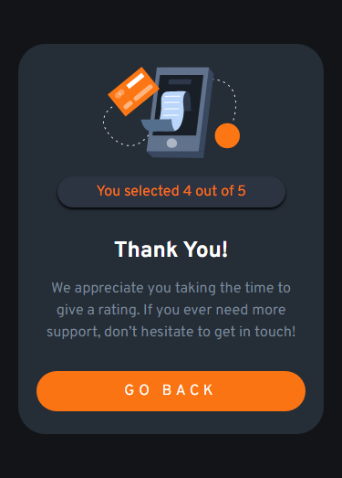
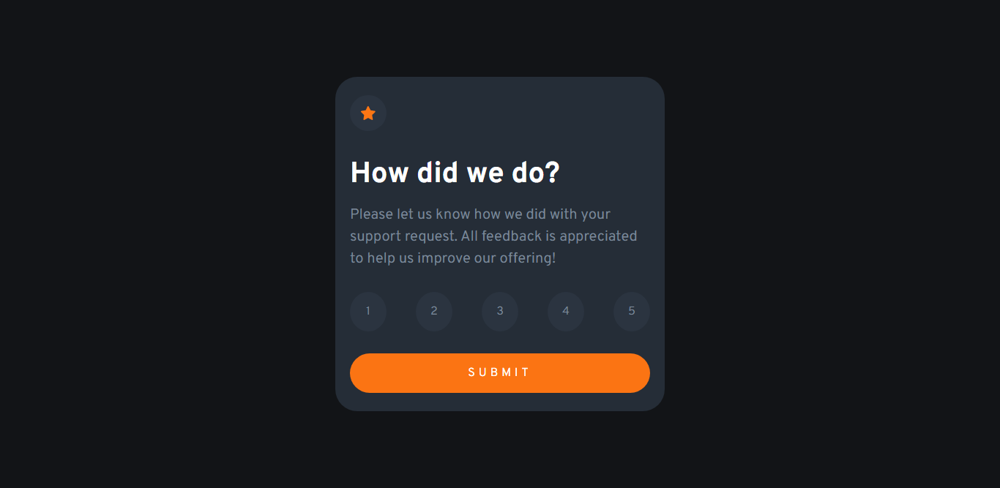
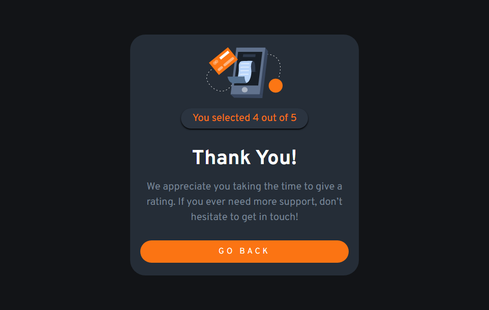

# Interactive rating component

Isso é uma solução criada do desafio do: [Frontend Mentor](https://www.frontendmentor.io/challenges/interactive-rating-component-koxpeBUmI). 

**Atenção o código apresentado é de minha autoria, não foi copiado de tutoriais, cursos e etc.**
## Tabela de conteúdo

- [Geral](#geral)
  - [O desafio](#o-desafio)
  - [Prints](#prints)
  - [Links](#links)
- [Meu processo](#meu-processo)
  - [Construido com](#Construido-com)
  - [O que eu aprendi](#o-que-eu-aprendi)
  - [Considerações finais](#Considerações-finais)
  - [Recursos que me ajudaram](#Recursos-que-me-ajudaram)
- [Autor](#autor)

## Geral

### O desafio:

O usuário deverá:

    -Ter o layout otimizado para cada tipo de dispositivo (responsividade)
    -Observar os elementos com hover na pagina
    -Ter a funcionalidade de submit e pode voltar para escolher o rating de novo

### Prints

Mobile:  

Desktop:  

Hovers  

### Links

- Site: [Clique aqui para acessar o site](https://matheuzeba.github.io/Interactive-rating-component/)

## Meu processo

### Construido com

- Html5 sematico
- CSS
- Flexbox
- Mobile-first 
- Javascript

### O que eu aprendi

Esse foi o meu primeiro projeto utilizando o javascript, demorei muito para finalizar ele pois estava doente. Mas o projeto foi muito legal no geral, principalmente porque agora posso aprender javascript enquanto aprimoro meu css.

Senti um pouco de dificuldade na hora de criar a lógica por trás do sistema de rating, mas consegui resolver depois de pesquisar e testar bastante.

O sistema de submit foi bem simples de faze, era so dar um display hide e flex.

### Considerações finais

Eu aprendi muito com esse desafio, e percebi que o javascript é uma linguagem e tanto. Vocês não conseguem imaginar a felicidade que senti ao terminar o projeto inteiro, ver ele funcionando sem problemas é bem legal :D

No geral sinto que o css não ficou tão bagunçado, nem o html. Mas pretendo focar mais no javascript por enquanto e variar entre os dois.

### Recursos que me ajudaram

- [Webdev simplified](https://www.youtube.com/@WebDevSimplified)

- [Kevin Powell](https://www.youtube.com/@KevinPowell)

- [r/javascript](https://old.reddit.com/r/javascript/)

- [O MDN me ajudou muito, principalmente neste tópico](https://developer.mozilla.org/en-US/docs/Web/JavaScript/Reference/Global_Objects/Array/forEach)

## autor

- Github - [matheuzeba](https://github.com/matheuzeba)
- Linkedin - [Meu Linkedin](https://www.linkedin.com/in/matheus-tavares-viana/?lipi=urn%3Ali%3Apage%3Ad_flagship3_profile_view_base_contact_details%3B3vUQkfjeQFmmKSAvffOo%2Fg%3D%3D)
